# Workflow N8N: Indexador Atômico de Normas

**Objetivo:** Processar PDFs de normas jurídicas, extrair dados estruturados via Gemini API, armazenar chunks no Google Sheets e registrar metadados no Supabase.

---

## 📋 Visão Geral do Workflow

```mermaid
graph TD
    A[Webhook/Form<br/>Upload PDF] --> B[Extract from File]
    B --> C[Split Text<br/>Chunking]
    C --> D[Loop Over Chunks]
    D --> E[Gemini API<br/>Extração JSON]
    E --> F[Google Sheets<br/>Append Rows]
    F --> G{Último Chunk?}
    G -->|Não| D
    G -->|Sim| H[Supabase<br/>Insert normas_index]
    H --> I[Response<br/>Sucesso]
```



**Total de Nodes:** 8-10 nodes  
**Tempo estimado de configuração:** 45-60 minutos  
**Complexidade:** Média

---

## 🔧 Configuração Node a Node

### Node 1: Webhook (Trigger)

**Tipo:** `Webhook`  
**Nome:** `Upload Norma PDF`

**Configuração:**
1. **HTTP Method:** `POST`
2. **Path:** `indexador-normas` (URL final: `https://n8n.johnsontn.com.br/webhook/indexador-normas`)
3. **Authentication:** `Header Auth`
   - **Name:** `x-api-key`
   - **Value:** `{{ $env.N8N_API_KEY }}` (usar variável de ambiente)
4. **Response Mode:** `When Last Node Finishes`
5. **Response Data:** `First Entry JSON`

**Dados esperados (Body):**
```json
{
  "assunto": "Regulamento de Férias 2024",
  "norma_vigente": "RES-001-2024",
  "pdf_url": "https://exemplo.com/norma.pdf",
  "orgao_emissor": "Justiça Militar da União"
}
```

---

### Node 2: HTTP Request (Download PDF)

**Tipo:** `HTTP Request`  
**Nome:** `Download PDF da Norma`

**Configuração:**
1. **Method:** `GET`
2. **URL:** `{{ $json.pdf_url }}`
3. **Response Format:** `File`
4. **Download File:** `true`
5. **File Name:** `norma_{{ $json.norma_vigente }}.pdf`
6. **Options:**
   - **Timeout:** `30000` (30 segundos)
   - **Follow Redirect:** `true`

---

### Node 3: Extract from File

**Tipo:** `Extract from File`  
**Nome:** `Extrair Texto do PDF`

**Configuração:**
1. **Operation:** `Extract Text`
2. **Binary Property:** `data` (padrão do HTTP Request)
3. **Options:**
   - **Extract Pages:** `All`
   - **Preserve Layout:** `false`

**Output:** Texto completo do PDF em `{{ $json.text }}`

---

### Node 4: Code (Chunking)

**Tipo:** `Code`  
**Nome:** `Dividir em Chunks (3-5 páginas)`

**Configuração:**
1. **Mode:** `Run Once for All Items`
2. **Language:** `JavaScript`

**Código:**
```javascript
// Receber texto completo do PDF
const textoCompleto = $input.first().json.text;
const metadados = $input.first().json;

// Configuração de chunking
const PALAVRAS_POR_PAGINA = 300; // Estimativa
const PAGINAS_POR_CHUNK = 4; // 3-5 páginas
const PALAVRAS_POR_CHUNK = PALAVRAS_POR_PAGINA * PAGINAS_POR_CHUNK;

// Dividir por palavras
const palavras = textoCompleto.split(/\s+/);
const chunks = [];

for (let i = 0; i < palavras.length; i += PALAVRAS_POR_CHUNK) {
  const chunk = palavras.slice(i, i + PALAVRAS_POR_CHUNK).join(' ');
  const chunkIndex = Math.floor(i / PALAVRAS_POR_CHUNK) + 1;
  
  chunks.push({
    chunk_id: `${metadados.norma_vigente}-C${String(chunkIndex).padStart(2, '0')}`,
    chunk_index: chunkIndex,
    conteudo_bruto: chunk,
    norma_vigente: metadados.norma_vigente,
    assunto: metadados.assunto,
    orgao_emissor: metadados.orgao_emissor,
    pdf_url: metadados.pdf_url
  });
}

return chunks;
```

**Output:** Array de objetos, cada um representando um chunk

---

### Node 5: Loop Over Items

**Tipo:** `Loop Over Items`  
**Nome:** `Processar Cada Chunk`

**Configuração:**
1. **Batch Size:** `1` (processar um chunk por vez)

---

### Node 6: Google Gemini (via HTTP Request)

**Tipo:** `HTTP Request`  
**Nome:** `Gemini - Extrair Dados Estruturados`

**Configuração:**
1. **Method:** `POST`
2. **URL:** `https://generativelanguage.googleapis.com/v1beta/models/gemini-1.5-pro:generateContent`
3. **Authentication:** `Generic Credential Type`
   - **Credential Type:** `API Key`
   - **API Key:** `{{ $env.GEMINI_API_KEY }}`
   - **Add To:** `Query Parameters`
   - **Key Name:** `key`

4. **Send Body:** `true`
5. **Body Content Type:** `JSON`
6. **Specify Body:** `Using JSON`

**Body (JSON):**
```json
{
  "contents": [{
    "parts": [{
      "text": "{{ $json.prompt_completo }}"
    }]
  }],
  "generationConfig": {
    "temperature": 0.1,
    "topK": 1,
    "topP": 0.95,
    "maxOutputTokens": 2048,
    "responseMimeType": "application/json"
  }
}
```

**Nota:** O `prompt_completo` será construído no próximo node (Code)

---

### Node 6.5: Code (Preparar Prompt)

**Tipo:** `Code`  
**Nome:** `Construir Prompt do Gemini`

**Inserir ANTES do Node 6 (Gemini)**

**Código:**
```javascript
const chunk = $input.first().json;

const PROMPT_SISTEMA = `Você é um assistente especializado em análise de normas jurídicas da Justiça Militar da União.

TAREFA: Analise o trecho de norma fornecido e extraia EXATAMENTE as seguintes informações em formato JSON:

ESTRUTURA JSON OBRIGATÓRIA:
{
  "identificador": "string (ex: RES-001-2024-C01)",
  "dispositivo": "string (ex: Art. 5º, §2º ou Capítulo III)",
  "status_vigencia": "string (vigente | revogado | suspenso)",
  "conteudo_integral": "string (texto completo do dispositivo)",
  "resumo_interpretativo": "string (resumo claro em 2-3 frases)",
  "prazos_gatilhos": "string (prazos mencionados ou 'N/A')",
  "normas_alteradoras": "string (normas que alteram este dispositivo ou 'N/A')",
  "tags_pentagonais": ["array", "de", "strings", "com", "5", "tags", "relevantes"]
}

REGRAS CRÍTICAS:
1. O campo "identificador" DEVE ser exatamente: ${chunk.chunk_id}
2. Se não houver dispositivo específico (Art., §, etc.), use "Texto Geral"
3. "status_vigencia" deve ser SEMPRE "vigente" a menos que o texto mencione revogação
4. "prazos_gatilhos" deve listar prazos em dias/meses (ex: "30 dias", "6 meses") ou "N/A"
5. "tags_pentagonais" deve conter EXATAMENTE 5 tags em português, minúsculas, relevantes ao conteúdo

RETORNE APENAS O JSON, SEM TEXTO ADICIONAL.`;

const CONTEUDO_NORMA = `
METADADOS:
- Norma: ${chunk.norma_vigente}
- Assunto: ${chunk.assunto}
- Órgão Emissor: ${chunk.orgao_emissor}
- Chunk ID: ${chunk.chunk_id}

TEXTO DA NORMA (TRECHO):
${chunk.conteudo_bruto}
`;

return [{
  json: {
    ...chunk,
    prompt_completo: PROMPT_SISTEMA + "\n\n" + CONTEUDO_NORMA
  }
}];
```

---

### Node 7: Code (Processar Resposta Gemini)

**Tipo:** `Code`  
**Nome:** `Extrair JSON da Resposta`

**Configuração:**

**Código:**
```javascript
const respostaGemini = $input.first().json;
const chunk = $input.first().json; // Dados originais do chunk

// Extrair JSON da resposta do Gemini
let dadosExtraidos;
try {
  const textoResposta = respostaGemini.candidates[0].content.parts[0].text;
  dadosExtraidos = JSON.parse(textoResposta);
} catch (error) {
  // Fallback se o Gemini não retornar JSON válido
  dadosExtraidos = {
    identificador: chunk.chunk_id,
    dispositivo: "Erro na extração",
    status_vigencia: "vigente",
    conteudo_integral: chunk.conteudo_bruto.substring(0, 500),
    resumo_interpretativo: "Erro ao processar com IA",
    prazos_gatilhos: "N/A",
    normas_alteradoras: "N/A",
    tags_pentagonais: ["erro", "processamento", "ia", "revisar", "manual"]
  };
}

// Garantir que tags_pentagonais seja array de strings
if (!Array.isArray(dadosExtraidos.tags_pentagonais)) {
  dadosExtraidos.tags_pentagonais = ["sem", "tags", "extraidas", "revisar", "manual"];
}

// Formatar para Google Sheets (8 colunas)
return [{
  json: {
    Identificador: dadosExtraidos.identificador,
    Dispositivo: dadosExtraidos.dispositivo,
    Status_Vigencia: dadosExtraidos.status_vigencia,
    Conteudo_Integral: dadosExtraidos.conteudo_integral,
    Resumo_Interpretativo: dadosExtraidos.resumo_interpretativo,
    Prazos_Gatilhos: dadosExtraidos.prazos_gatilhos,
    Normas_Alteradoras: dadosExtraidos.normas_alteradoras,
    Tags_Pentagonais: dadosExtraidos.tags_pentagonais.join(', '),
    // Metadados adicionais
    _norma_vigente: chunk.norma_vigente,
    _processado_em: new Date().toISOString()
  }
}];
```

---

### Node 8: Google Sheets (Append)

**Tipo:** `Google Sheets`  
**Nome:** `Salvar Chunk no Google Sheets`

**Configuração:**

#### Credenciais (Primeira vez):
1. No n8n, vá em **Credentials** → **New**
2. Selecione **Google Sheets OAuth2 API**
3. **Client ID:** (obter do Google Cloud Console)
4. **Client Secret:** (obter do Google Cloud Console)
5. **OAuth Callback URL:** `https://n8n.johnsontn.com.br/rest/oauth2-credential/callback`
6. Clique em **Connect my account** e autorize

#### Configuração do Node:
1. **Credential to connect with:** Selecionar credencial criada acima
2. **Resource:** `Sheet`
3. **Operation:** `Append`
4. **Document:** `By URL` → Criar nova planilha manualmente no Google Sheets e colar URL
   - **Nome da planilha:** `Normas_Atomicas_JMU`
   - **Cabeçalhos (Linha 1):** Identificador | Dispositivo | Status_Vigencia | Conteudo_Integral | Resumo_Interpretativo | Prazos_Gatilhos | Normas_Alteradoras | Tags_Pentagonais
5. **Sheet:** `Sheet1`
6. **Columns:** `Auto-Map Input Data to Columns`
7. **Options:**
   - **Data Mode:** `Auto-Map Columns`

---

### Node 9: Supabase (Insert - Final)

**Tipo:** `Supabase`  
**Nome:** `Registrar Norma no Índice`

**Configuração:**

#### Credenciais:
1. **Host:** `aws-0-us-west-2.pooler.supabase.com`
2. **Database:** `postgres`
3. **User:** `postgres.tawymhilpwkatuglxgae`
4. **Password:** `wSjvvEQPyM6TPn8x`
5. **SSL:** `require`
6. **Port:** `5432`

#### Configuração do Node:
1. **Resource:** `Row`
2. **Operation:** `Create`
3. **Table:** `normas_index`
4. **Schema:** `adminlog`
5. **Data to Send:** `Define Below for Each Column`

**Mapeamento de Colunas:**
```
assunto: {{ $('Upload Norma PDF').item.json.assunto }}
norma_vigente: {{ $('Upload Norma PDF').item.json.norma_vigente }}
artigos_count: {{ $('Dividir em Chunks').all().length }}
tags_pentagonais: {{ $json.tags_agregadas }}
pdf_original_url: {{ $('Upload Norma PDF').item.json.pdf_url }}
google_sheets_atomic_link: {{ $env.GOOGLE_SHEETS_URL }}
```

**Nota:** Você precisará criar um node Code antes deste para agregar as tags de todos os chunks

---

### Node 9.5: Code (Agregar Tags)

**Tipo:** `Code`  
**Nome:** `Agregar Tags de Todos os Chunks`

**Inserir ANTES do Node 9 (Supabase)**

**Código:**
```javascript
// Obter todos os chunks processados
const todosChunks = $('Salvar Chunk no Google Sheets').all();

// Extrair todas as tags
const todasTags = [];
todosChunks.forEach(chunk => {
  const tags = chunk.json.Tags_Pentagonais.split(', ');
  todasTags.push(...tags);
});

// Contar frequência e pegar top 10
const frequencia = {};
todasTags.forEach(tag => {
  frequencia[tag] = (frequencia[tag] || 0) + 1;
});

const tagsOrdenadas = Object.entries(frequencia)
  .sort((a, b) => b[1] - a[1])
  .slice(0, 10)
  .map(([tag]) => tag);

return [{
  json: {
    tags_agregadas: JSON.stringify(tagsOrdenadas)
  }
}];
```

---

### Node 10: Respond to Webhook

**Tipo:** `Respond to Webhook`  
**Nome:** `Retornar Sucesso`

**Configuração:**
1. **Respond With:** `JSON`
2. **Response Body:**
```json
{
  "status": "success",
  "message": "Norma indexada com sucesso",
  "norma_vigente": "{{ $('Upload Norma PDF').item.json.norma_vigente }}",
  "chunks_processados": {{ $('Dividir em Chunks').all().length }},
  "google_sheets_url": "{{ $env.GOOGLE_SHEETS_URL }}",
  "supabase_id": "{{ $('Registrar Norma no Índice').item.json.id }}"
}
```

---

## 🔑 Configuração de Credenciais Google Sheets

### Opção 1: OAuth2 (Recomendado para uso pessoal)

1. **Acesse:** [Google Cloud Console](https://console.cloud.google.com/)
2. **Crie um projeto:** "N8N JMU Integration"
3. **Ative APIs:**
   - Google Sheets API
   - Google Drive API
4. **Crie credenciais OAuth 2.0:**
   - Tipo: Web application
   - Authorized redirect URIs: `https://n8n.johnsontn.com.br/rest/oauth2-credential/callback`
5. **Copie:** Client ID e Client Secret
6. **No n8n:** Cole as credenciais e autorize

### Opção 2: Service Account (Recomendado para produção)

1. **No Google Cloud Console:**
   - IAM & Admin → Service Accounts → Create
   - Nome: `n8n-indexador-jmu`
   - Role: Editor
2. **Crie chave JSON** e baixe
3. **No n8n:**
   - Credentials → Google Service Account
   - Cole o conteúdo do JSON
4. **Compartilhe a planilha** com o email da Service Account

---

## 📊 Estrutura da Planilha Google Sheets

**Nome:** `Normas_Atomicas_JMU`  
**URL:** (criar manualmente e salvar em variável de ambiente `GOOGLE_SHEETS_URL`)

**Cabeçalhos (Linha 1):**
| A | B | C | D | E | F | G | H |
|---|---|---|---|---|---|---|---|
| Identificador | Dispositivo | Status_Vigencia | Conteudo_Integral | Resumo_Interpretativo | Prazos_Gatilhos | Normas_Alteradoras | Tags_Pentagonais |

---

## ✅ Checklist de Validação

Antes de ativar o workflow:

- [ ] Webhook configurado e URL testada
- [ ] Credenciais Google Sheets autorizadas
- [ ] Planilha criada com cabeçalhos corretos
- [ ] Variável de ambiente `GOOGLE_SHEETS_URL` definida
- [ ] Variável de ambiente `GEMINI_API_KEY` definida
- [ ] Credenciais Supabase testadas
- [ ] Teste com PDF pequeno (2-3 páginas)
- [ ] Verificar inserção no Google Sheets
- [ ] Verificar registro no Supabase

---

## 🧪 Teste Manual

**Comando cURL:**
```bash
curl -X POST https://n8n.johnsontn.com.br/webhook/indexador-normas \
  -H "Content-Type: application/json" \
  -H "x-api-key: SEU_API_KEY" \
  -d '{
    "assunto": "Teste - Regulamento Interno",
    "norma_vigente": "TEST-001-2026",
    "pdf_url": "https://exemplo.com/teste.pdf",
    "orgao_emissor": "JMU - Teste"
  }'
```

**Resultado esperado:**
- Status 200
- Google Sheets com N linhas (N = número de chunks)
- Supabase com 1 registro em `adminlog.normas_index`

---

## 🚀 Próximos Passos

Após validar este workflow:
1. Criar Workflow 2: Gerador de Modelos (Google Docs)
2. Criar Workflow 3: Agente RAG (Advanced AI nodes)
3. Integrar com Appsmith (botão "Indexar Nova Norma")
